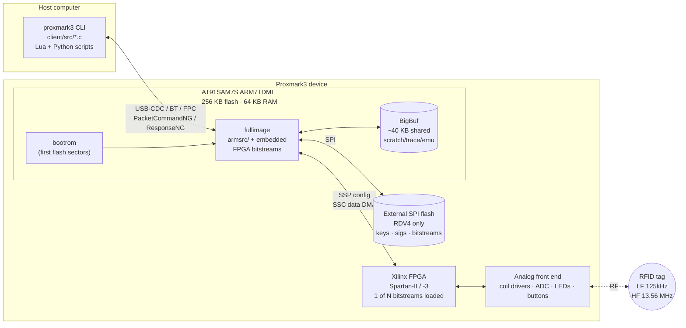
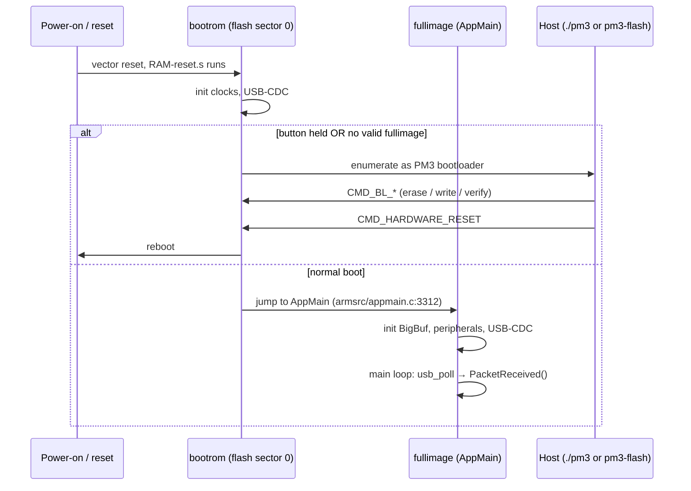
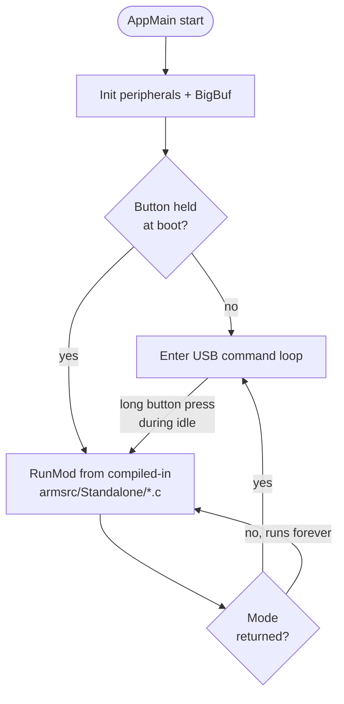

# 03 — Runtime Architecture

How a running Proxmark3 system is wired together.

## The big picture



The host **never** talks to the FPGA or to a tag directly. Every byte of RF data has been chewed on by the FPGA, then by the ARM firmware, before it hits the wire to the host. Conversely every host command is just an instruction to the ARM to *go do this thing on the air*.

## Boot sequence



The **bootrom is sacrosanct**: `pm3-flash-fullimage` cannot brick the bootrom, only the application. `pm3-flash-bootrom` (or JTAG via `recovery/`) can. The button-held-at-power-up gesture is the only escape hatch if the fullimage is wedged.

## Flash layout (AT91SAM7S 256 KB)

```
0x00100000 +----------------------+
           |     bootrom code     |  ~8 KB, written by pm3-flash-bootrom
           |                      |
0x00102000 +----------------------+  (boundary varies per build; see ldscript)
           |                      |
           |    fullimage code    |  ~240 KB, written by pm3-flash-fullimage
           |    + embedded        |   includes compressed FPGA bitstreams
           |      FPGA bitstreams |   and version info (mkversion.sh)
           |                      |
0x0013FFFF +----------------------+
```

Plus a **common area** in RAM (`g_common_area`) that the bootrom and fullimage both know how to find — used to pass mode flags between them across a soft reset.

## RAM layout & BigBuf

```
0x00200000 +----------------------+
           |  .data + .bss        |  globals, stacks
           +----------------------+
           |                      |
           |       BigBuf         |  Single contiguous arena, ~40 KB on RDV4.
           |  ┌────────────────┐  |  Carved up at runtime into:
           |  │  trace log     │  |   • trace log (sniff captures)
           |  ├────────────────┤  |   • emulator memory (when simulating a tag)
           |  │  emu memory    │  |   • DMA buffers for ADC → SSC
           |  ├────────────────┤  |   • protocol scratch (key tables, etc.)
           |  │  DMA / scratch │  |  Only one operation owns BigBuf at a time;
           |  └────────────────┘  |  `BigBuf_Clear()` is called at the start of
           |                      |  almost every command.
0x0020FFFF +----------------------+
```

`BigBuf.[ch]` is the gatekeeper. Allocating "memory" inside the firmware almost always means asking BigBuf for an offset.

## The ARM main loop

```
                AppMain() [appmain.c:3312]
                       │
                       ▼
              init clocks, USB-CDC,
              BigBuf, FPGA loader,
              standalone mode (if any)
                       │
                       ▼
          ┌───────►  for(;;) loop  ◄───────┐
          │            │                   │
          │            ▼                   │
          │   usb_poll_validate_length()   │ no
          │            │                   │
          │       data ready?  ────────────┘
          │            │ yes
          │            ▼
          │   parse PacketCommandNG rx
          │            │
          │            ▼
          │   PacketReceived(&rx)    ◄── giant switch on rx.cmd
          │            │                  dispatches to per-protocol
          │            │                  functions in iso14443a.c,
          │            │                  lfops.c, iclass.c, etc.
          │            ▼
          │   reply_ng() / reply_mix()  ── sends PacketResponseNG back
          │            │
          └────────────┘
```

Important properties:

- **Cooperative, single-threaded.** No RTOS. Long-running commands (sniff, simulate) just run inside `PacketReceived()` and use timers + the user button to bail. The host can interrupt by sending `CMD_BREAK_LOOP`/`CMD_QUIT_SESSION`, which the long-running code polls for via `BUTTON_PRESS() || data_available()`.
- **No dynamic allocation.** Everything is static or carved from BigBuf.
- **Standalone mode** is a special case: when the user long-presses the button with no host attached, `RunMod()` from the selected `armsrc/Standalone/*.c` is called instead of waiting for USB commands.

## The FPGA's role at runtime

```
                ARM                                  FPGA
                                       SPI cfg word
   FpgaWriteConfWord(cfg) ─────────────────────────▶  shift_reg
                                                       │
                                                       ▼
                                         decode 16-bit config word into:
                                          • major mode (LF reader / HF
                                            reader / sniff / sim / passthru …)
                                          • minor flags (mod type, divisor)
                                                       │
                                                       ▼
                                         route ADC + coil-driver lines
                                         through the selected sub-module
                                         (lo_read / hi_iso14443a / …)
                                                       │
              SSC DMA ◀───── sampled bits/bytes ──────┘
              ssp_dout ─────▶ tx bits to modulate ───▶  coil drivers
```

So the FPGA is a runtime-reconfigurable signal processor between the antenna and the ARM's SSC peripheral. Switching tag protocols means:

1. Possibly re-load a different bitstream (`FpgaDownloadAndGo(FPGA_BITSTREAM_HF)` etc.) if the previous one wasn't the right family.
2. Always re-send a config word over SPI to select the right sub-module and parameters.

Bitstream families on a standard board: `lf`, `hf`, `hf_15` (ISO15693 needs a slightly different demodulator), `felica`. Loading a bitstream takes tens of ms; flipping the config word is microseconds.

## Standalone mode dispatch



`dankarmulti` is special: it's a meta-mode that lets several real modes coexist in one firmware image and lets the user pick between them via button gestures.

## Where each tier lives in the repo

| Tier        | Source roots                                | Build artifact |
|-------------|---------------------------------------------|----------------|
| Host CLI    | `client/`, `common/`, `tools/`              | `client/proxmark3` |
| Bootrom     | `bootrom/`, `common_arm/`                   | `bootrom/obj/bootrom.elf → bootrom.bin` |
| Fullimage   | `armsrc/`, `common_arm/`, `common/`, `include/` | `armsrc/obj/fullimage.elf → fullimage.bin` |
| FPGA        | `fpga/`, `common_fpga/`                     | `fpga/fpga_pm3_*.bit` (checked in, not rebuilt by default) |
| Combined    | `recovery/`                                 | `recovery/proxmark3_recovery.bin` (bootrom+fullimage for JTAG) |
