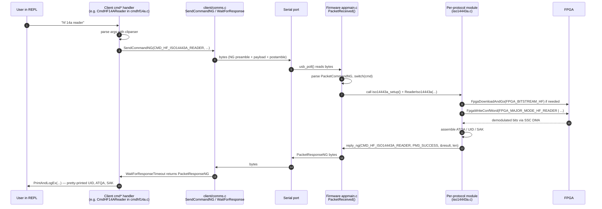

# 04 — Host ↔ Device Communication

How `./pm3` on your laptop talks to the firmware on the device.

## Physical transports

```
+-----------------+     +-----------------------+    +--------------------------+
|  Host program   |     | OS serial port driver |    |  Proxmark3 device USB    |
|  client/        | <-> |  /dev/ttyACMx (Lin)   | <->|  CDC-ACM endpoint        |
|  comms.c        |     |  /dev/cu.usbmodem*    |    |  common_arm/usb_cdc.c    |
+-----------------+     |  COMx                 |    +--------------------------+
                        +-----------------------+
                                                     - same code path used by both
                                                       bootrom and fullimage
```

Other transports the client supports (`client/src/comms.c` + `client/src/uart/`):

- **USB-CDC over the on-board ATmega** — the default. From the host it's an ordinary CDC-ACM serial port.
- **Bluetooth SPP** — when the RDV4 BT add-on (`tools/btaddon/`) is plugged into the FPC connector. From the host it looks like another serial port (`/dev/rfcomm0` or similar).
- **TCP** — `pm3 -p tcp:host:port`. Used for relays, USB-over-IP, Termux/Android setups, the SE/X variants where the BT or another transport is exposed as a socket.
- **Named pipe / FPC** — RDV4 also exposes the same protocol on its FPC connector, which the BT add-on or a USB-UART dongle can hook into.

The wire format is **identical on every transport**. The serial port is just a byte pipe.

## Frame format: PacketCommandNG / PacketResponseNG

There are actually **two** generations of frame format coexisting in this codebase. The newer one is called *NG* (Next Generation); the older one is called *OLD*. The header in `include/pm3_cmd.h` defines both.

### NG frames (preferred for all new code)

```
   ┌───────────────────────┬───────────────┬───────────────────────┐
   │   Preamble (8 bytes)  │   Variable    │   Postamble (2 bytes) │
   │                       │   payload     │                       │
   │  magic   "PM3a"/"PM3b"│  0..512 bytes │   crc16 (or 0x3361/   │
   │  length  15 bits      │               │         0x3362 magic) │
   │  ng      1 bit (=1)   │               │                       │
   │  cmd     16 bits      │               │                       │
   │  + status/reason on   │               │                       │
   │    responses          │               │                       │
   └───────────────────────┴───────────────┴───────────────────────┘
```

- **Commands**  (host → device) carry preamble magic `0x61334d50` (`"PM3a"`), postamble magic `0x3361` (`"a3"`).
- **Responses** (device → host) carry preamble magic `0x62334d50` (`"PM3b"`), postamble magic `0x3362` (`"b3"`).
- `cmd` is one of the `CMD_*` constants in `include/pm3_cmd.h` (this enum is shared by both sides and is the **single source of truth** for the protocol surface).
- `length` is the payload length (max `PM3_CMD_DATA_SIZE` = 512). The MSB is repurposed as the `ng` bit so OLD and NG can be told apart.
- Responses additionally carry `status` (a `PM3_*` return code like `PM3_SUCCESS`, `PM3_ETIMEOUT`, `PM3_EINVARG`) and `reason`.
- Postamble holds a CRC16 over the framed bytes (or the magic constant if CRC is disabled, which the slow-link path does).

### OLD frames (legacy)

A fixed 544-byte structure: `{uint64_t cmd; uint64_t arg[3]; uint8_t data[512];}` with no CRC. Many commands still use this for historical reasons. The receiver auto-detects which generation a frame is.

### MIX frames

A practical halfway house: NG framing, but the payload is `{uint64_t arg[3]; uint8_t data[];}` so that command handlers written for the OLD format don't need rewriting. Sent via `SendCommandMIX()` / `reply_mix()`.

## End-to-end command flow



## API surface, both sides

### Firmware-side senders (`armsrc/cmd.c`)

| Function | Use |
|----------|-----|
| `reply_ng(cmd, status, data, len)`             | Preferred. NG frame with explicit status/reason. |
| `reply_mix(cmd, arg0, arg1, arg2, data, len)`  | Migration shim — NG frame, but payload starts with the legacy 3 args. |
| `reply_old(cmd, arg0, arg1, arg2, data, len)`  | Legacy OLD frame. Avoid in new code. |
| `reply_ng_internal(... , reason, ...)`         | Internal — lets you set a `PM3_REASON_*` reason code. |
| `Dbprintf("…")`                                | Sends a debug-text response (cmd = `CMD_DEBUG_PRINT_STRING`). |

### Firmware-side receiver (`armsrc/appmain.c`)

- `PacketReceived(PacketCommandNG *packet)` — one massive `switch (packet->cmd)`. Every handled command is one case. Long-running commands run inline and return from this function (which puts the main loop back to polling USB).
- Long-running ops check `BUTTON_PRESS() || data_available()` to abort. The host abort path is `CMD_BREAK_LOOP` (NG, no payload).

### Host-side senders (`client/src/comms.c`)

| Function | Use |
|----------|-----|
| `SendCommandNG(cmd, data, len)`                                       | Preferred. |
| `SendCommandMIX(cmd, arg0, arg1, arg2, data, len)`                    | Pair with `reply_mix`. |
| `SendCommandOLD(cmd, arg0, arg1, arg2, data, len)`                    | Legacy. |
| `SendCommandBL(...)`                                                  | Speaks to the bootrom (different command-ID space). |

### Host-side receiver

| Function | Use |
|----------|-----|
| `WaitForResponseTimeout(cmd, &resp, ms)`                              | Block until response with given `cmd` arrives, or timeout. |
| `WaitForResponse(cmd, &resp)`                                         | Same, default timeout. |
| `WaitForResponseTimeoutW(cmd, &resp, ms, show_warning)`               | …with control over the "timeout" warning. |
| `GetFromDevice(MemType, dest, bytes, start, …)`                       | Streamed bulk transfer (BigBuf dump, flash dump, sample dump). Sends `CMD_DOWNLOAD_*` then assembles incoming chunks. |

A dedicated receiver thread in the client drains the serial port into a thread-safe queue; the `WaitFor*` calls pull from that queue, matching on `resp.cmd`. This means **out-of-order responses are fine** — debug prints (`CMD_DEBUG_PRINT_STRING`) and async notifications can arrive at any time and are handled separately from the response the caller is waiting for.

## Bulk transfers and the BigBuf download path

For anything bigger than 512 bytes (BigBuf dumps, sample captures, flash reads), the protocol is **chunked**:

```
host                                       device
  │                                          │
  │── CMD_DOWNLOAD_BIGBUF (start, len) ─────▶│
  │                                          │  loop in firmware:
  │◀── CMD_DOWNLOADED_BIGBUF (chunk 1) ──────│   copy next 512 bytes
  │◀── CMD_DOWNLOADED_BIGBUF (chunk 2) ──────│   from BigBuf into a frame
  │            …                             │   reply_ng() it
  │◀── CMD_ACK (final) ──────────────────────│  done
  │                                          │
```

Each chunk is a normal `PacketResponseNG`. `GetFromDevice()` on the host knows the protocol and reassembles. Similar variants exist for external flash (`CMD_FLASHMEM_DOWNLOAD`), emulator memory, traces, etc.

## Slow links

The header defines `USART_SLOW_LINK` because over BT/UART the round-trip is much higher than USB. The code adapts timeouts and disables some CRC checks when the link is slow. See `usart_defs.h`.

## Where to look

- The command-ID enum: `include/pm3_cmd.h` (read this whole file once — it *is* the protocol).
- Wire format and helpers (host): `client/src/comms.[ch]`.
- Wire format and helpers (firmware): `armsrc/cmd.[ch]`, `common_arm/usb_cdc.[ch]`.
- The big dispatcher: `armsrc/appmain.c` → `PacketReceived()`.
- The client's top-level command tree: `client/src/cmdmain.c` and `client/src/cmdparser.c`.
