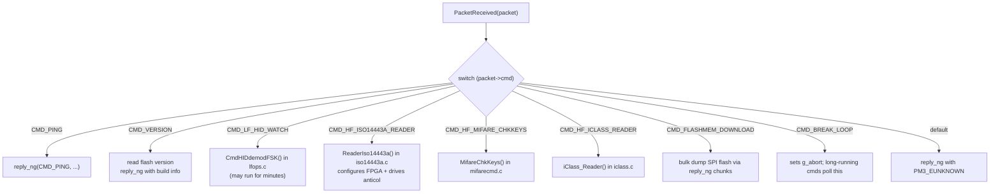
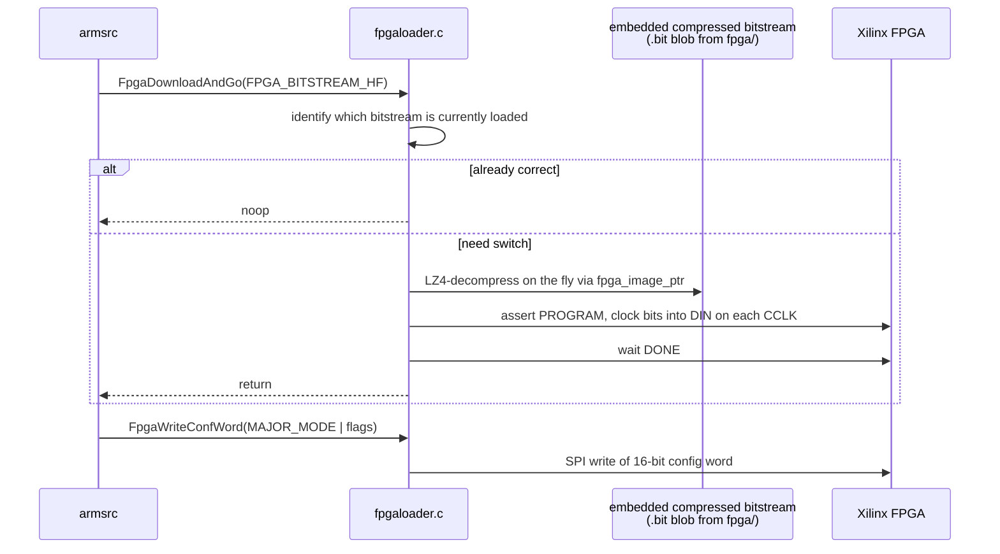

# 05 — ARM Firmware Deep Dive

Everything that lives in `armsrc/` (plus `bootrom/` and `common_arm/`).

## Mental model

```
                          armsrc/  (fullimage)
                          ─────────────────
                                  │
            ┌─────────────────────┼─────────────────────────┐
            │                     │                         │
            ▼                     ▼                         ▼
       appmain.c              Per-protocol             Standalone/
       (dispatcher)           modules                  (one optional
                              (iso14443a.c,            host-less app)
                              lfops.c,
                              iclass.c, …)
            │                     │
            └─────────┬───────────┘
                      │   shared services
                      ▼
   ┌──────────────┬──────────────┬──────────────┬──────────────┐
   │  BigBuf.c    │ fpgaloader.c │  cmd.c       │  dbprint.c   │
   │  RAM arena   │  load+config │  send replies│  debug log   │
   │              │  FPGA bits   │              │              │
   └──────────────┴──────────────┴──────────────┴──────────────┘
                      │
                      ▼
                common_arm/   (shared with bootrom)
                ─────────────
                usb_cdc.c   clocks.c   ticks.c   flashmem.c
```

## Entry point and main loop

```c
// armsrc/appmain.c:3312
void __attribute__((noreturn)) AppMain(void) {
    // 1. Hardware init: clocks, GPIO, USB-CDC, ADC, SSC.
    // 2. BigBuf_Clear() / BigBuf_Clear_ext().
    // 3. If a standalone mode is compiled in AND user is holding the button:
    //       RunMod();   // never returns
    // 4. Main loop:
    for (;;) {
        if (usb_poll_validate_length()) {
            PacketCommandNG rx;
            if (receive_ng(&rx) == PM3_SUCCESS)
                PacketReceived(&rx);
        }
        // also: button long-press here can launch standalone mode
    }
}
```

Single-threaded, no RTOS, no interrupt-driven command dispatch. The model is *poll USB, run command to completion, poll USB again*.

### Why no preemption?

Almost every RF operation has hard timing requirements (microsecond-level). The firmware runs them with interrupts mostly *disabled* in the hot inner loops. A preemptive scheduler would only get in the way. The cost is that **a misbehaving command blocks the device**, which is why the abort path (button + `CMD_BREAK_LOOP`) matters.

## The dispatcher: `PacketReceived()`



The switch is ~2000 lines. There's effectively one case per command in `include/pm3_cmd.h`. Most cases:

1. Pull a typed struct out of `packet->data.asBytes` (e.g. `iclass_card_select_t *p = (iclass_card_select_t *) packet->data.asBytes`).
2. Call into a per-protocol module.
3. `reply_ng()` with the result.

## Per-protocol modules

Each `.c/.h` pair in `armsrc/` is a small library that knows one RF protocol family.

| Module | What it does |
|---|---|
| `iso14443a.c` (+ `mifarecmd.c`, `mifareutil.c`, `mifaresim.c`, `mifaredesfire.c`) | All MIFARE / NTAG / ISO14443-A. Reader, sniffer, simulator, crypto1, DESFire. |
| `iso14443b.c` | ISO14443-B (calypso, srix, picopass-B, etc.). |
| `iso15693.c` (uses `common/iso15693tools`) | ISO15693 (vicinity cards, ICODE). |
| `iclass.c` (+ `sam_picopass.c`, `optimized_*`) | HID iCLASS / picopass. |
| `legicrf.c` + `legicrfsim.c` | LEGIC Prime. |
| `felica.c` | Sony FeliCa (ISO18092). |
| `hitag2.c` / `hitagS.c` / `hitagu.c` + `hitag2_crack.c` | Hitag family. |
| `em4x50.c`, `em4x70.c` | EM4x50 / EM4x70 LF. |
| `lfops.c` + `lfsampling.c` + `lfadc.c` + `lfdemod.c` (shared) | All LF: HID Prox, EM410x, Indala, AWID, IO Prox, Paradox, T55xx etc. |
| `pcf7931.c` | PCF7931 LF chip. |
| `epa.c` | German electronic passports (EAC). |
| `emvsim.c` | EMV (banking card) simulation. |
| `seos.c` | HID SEOS. |
| `thinfilm.c` | NFC barcodes. |
| `sam_*.c` | RDV4 Secure Access Module (smartcard slot) integration. |
| `hfops.c` | Generic HF helpers / raw HF mode. |

Each module follows a similar pattern:

```c
void DoTheProtocolThing(uint8_t *param, size_t paramlen) {
    LED_A_ON();
    BigBuf_free();                         // claim BigBuf
    iso14443a_setup(FPGA_HF_ISO14443A_READER_LISTEN);  // load+config FPGA
    set_tracing(true);                     // start sniff/trace log

    // ... drive the protocol over SSC, possibly looping ...

    if (BUTTON_PRESS() || data_available())
        goto out;                          // user aborted

    reply_ng(CMD_HF_…, status, result, sizeof(*result));
out:
    FpgaWriteConfWord(FPGA_MAJOR_MODE_OFF);
    LED_A_OFF();
}
```

## BigBuf: the shared memory arena

`BigBuf.[ch]` carves the on-chip RAM (post-globals/stack) into a single arena and hands it out by purpose:

```
   +----------------------------------------+
   |  trace log  (BigBuf_get_trace())       |  Sniff/replay timing data, ASCII dumps
   +----------------------------------------+
   |  emulator memory  (BigBuf_get_EM_addr) |  Tag contents when device is simulating
   +----------------------------------------+
   |  protocol scratch (BigBuf_malloc)      |  Working buffers (key tables, sample buf)
   +----------------------------------------+
   |  DMA region                            |  ADC → SSC ring buffer
   +----------------------------------------+
```

Rules:

- `BigBuf_Clear()` / `BigBuf_free()` at the top of most handlers.
- The trace log uses `LogTrace()` / `LogTraceBits()`, gated by `set_tracing()`.
- Emulator memory persists across commands as long as no other op nukes BigBuf — that's how you can load a card into the device and then run multiple `hf 14a sim`-style commands.

## FPGA loader



Notes:

- Bitstreams are compressed at firmware-build time by `tools/fpga_compress` so they fit in flash.
- The currently loaded bitstream is tracked in a static so re-calls are cheap.
- The config word is defined in `common_fpga/fpga.h` and decoded inside the Verilog top module.

## Tracing & sniffing

Most protocols call `LogTrace(buf, len, t_start, t_end, parity, isReader)` for every air frame they see. The trace log lives in BigBuf. The client downloads it via `CMD_DOWNLOAD_BIGBUF` (or the dedicated trace-download command) and decodes it via `data` / `trace list` commands.

## Standalone modes

```
armsrc/Standalone/
├── readme.md            ← the spec for writing one
├── Makefile.hal         ← list of supported modes per platform
├── Makefile.inc         ← sources per mode
├── dankarmulti.c        ← meta-mode bundling several
├── lf_samyrun.c         ← HID26 read/clone/sim
├── hf_14asniff.c        ← passive ISO14443-A sniffer
├── hf_iceclass.c        ← iCLASS attack mode
├── hf_legicsim.c        ← LEGIC sim
├── hf_mattyrun.c        ← MIFARE auto-clone
├── …
```

Contract:

```c
void ModInfo(void)  { DbpString("My standalone, by me"); }
void RunMod(void)   { /* runs until reboot */ }
```

`RunMod()` is called from `AppMain()` on button-long-press boot. Build with `make STANDALONE=HF_ICECLASS` (or similar) — only **one** is compiled in per image, except `dankarmulti` which bundles several.

## Bootrom (`bootrom/`)

The bootrom is intentionally minimal — fewer features → fewer ways to brick.

```
bootrom flow
─────────────

  reset vector (ram-reset.s / flash-reset.s)
        │
        ▼
  init clocks, USB-CDC          ◄── reuses common_arm/usb_cdc.c
        │
        ▼
  check common-area flags + button
        │
   ┌────┴─────────────────────────────┐
   │                                  │
   ▼                                  ▼
  jump to AppMain()        listen on USB-CDC for
  (normal boot)            CMD_BL_* flash commands:
                           CMD_BL_VERSION
                           CMD_BL_WRITE_FLASH
                           CMD_BL_FINISH_WRITE
                           CMD_HARDWARE_RESET
                           …
                                  │
                                  ▼
                           erase/program flash sectors
                           (skipping the bootrom region
                            unless explicitly enabled)
```

Build artifact: `bootrom/obj/bootrom.elf` → `bootrom.bin`. Flashed by:

- `pm3-flash-bootrom` (over USB-CDC via the *running* bootrom) — needs the bootrom already there.
- JTAG via `recovery/` and `tools/jtag_openocd/`.

## common_arm (shared bootrom ↔ fullimage)

- `usb_cdc.[ch]` — bitbangs the USB device endpoint registers; presents a CDC-ACM serial port to the host. Same code in both images so the host can speak the same `PacketCommandNG` protocol to either.
- `clocks.[ch]` — PLL/PIT init.
- `ticks.[ch]` — `GetTickCount()`, busy waits, microsecond delays.
- `flashmem.[ch]` — driver for the external SPI flash on RDV4 (where keys, signatures, and additional bitstreams live).

## Build-time platform glue

`common_arm/Makefile.hal` is read by every Makefile that produces ARM code (bootrom, armsrc, recovery). It:

1. Maps `PLATFORM=PM3RDV4|PM3GENERIC|PM3ICOPYX|PM3ULTIMATE` to `PLATFORM_DEFS` (preprocessor flags).
2. Picks which FPGA bitstreams to embed.
3. Adds `PLATFORM_EXTRAS=BTADDON` if you have the BT add-on.
4. Pulls in `armsrc/Standalone/Makefile.hal` to know which standalone modes are valid for that platform.
