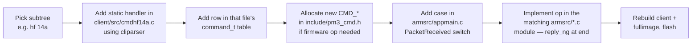

# 07 — Host Client

The `client/` directory is the desktop program — the thing users actually run as `./pm3` or `proxmark3`.

## High-level shape

```
                       user types "hf 14a info"
                                 │
                                 ▼
            ┌──────────────────────────────────────────┐
            │  linenoise REPL   (client/deps/linenoise)│
            └────────────────────┬─────────────────────┘
                                 │
                                 ▼
            ┌──────────────────────────────────────────┐
            │  main_loop (proxmark3.c)                 │
            │   → CommandReceived(line)                │
            └────────────────────┬─────────────────────┘
                                 ▼
            ┌──────────────────────────────────────────┐
            │  cmdmain.c   ── top-level CommandTable[] │
            │   { "hf", CmdHF, … },                    │
            │   { "lf", CmdLF, … },                    │
            │   { "data", CmdData, … },  …             │
            └────────────────────┬─────────────────────┘
                                 │  CmdsParse walks tree
                                 ▼
            ┌──────────────────────────────────────────┐
            │  cmdhf.c  (hf subtree)                   │
            │    { "14a", CmdHF14A, … },               │
            │    { "iclass", CmdHFiClass, … },  …      │
            └────────────────────┬─────────────────────┘
                                 ▼
            ┌──────────────────────────────────────────┐
            │  cmdhf14a.c   leaf command handlers      │
            │    CmdHF14AReader, CmdHF14AInfo, …       │
            │                                          │
            │    1. cliparser_*  parse argv            │
            │    2. SendCommandNG(CMD_HF_…, ...)       │
            │    3. WaitForResponseTimeout(...)        │
            │    4. PrintAndLogEx pretty-print         │
            └──────────────────────────────────────────┘
```

## Command tree

The top-level `CommandTable[]` in `client/src/cmdmain.c`:

```
top-level
├── analyse   {analyse utils}              (cmdanalyse.c)
├── data      {plot / sample buffer}       (cmddata.c)
├── emv       {EMV / ISO-7816}             (emv/cmdemv.c)
├── hf        {HF commands}                (cmdhf.c)         ─┐
├── hw        {hardware}                   (cmdhw.c)          │
├── lf        {LF commands}                (cmdlf.c)         ─┤  same pattern
├── mem       {RDV4 SPI flash}             (cmdflashmem.c)    │  one cmd*.c
├── mqtt      {MQTT bridge}                (cmdmqtt.c)        │  per subtree
├── nfc       {NFC NDEF/Type4 helpers}     (cmdnfc.c)         │
├── piv       {PIV smart-card}             (cmdpiv.c)        ─┤
├── reveng    {CRC reverse-engineering}    (cmdcrc.c)         │
├── smart     {ISO-7816 smartcard}         (cmdsmartcard.c)   │
├── script    {Lua / Python / cmd scripts} (cmdscript.c)      │
├── trace     {sniff trace decode}         (cmdtrace.c)       │
├── usart     {RDV4 FPC USART passthrough} (cmdusart.c)       │
├── wiegand   {Wiegand format helpers}     (cmdwiegand.c)    ─┘
└── auto / clear / hints / msleep / rem / quit  (built-ins)
```

Each subtree (`hf`, `lf`, `data`, …) is itself another `command_t[]` — `CmdHF` is `CmdsParse(cmdhf_commandtable, Cmd)` and so on, recursing as deep as needed. Help text bubbles up automatically via `CmdsHelp()`.

There are **~150 `cmd*.c` files** under `client/src/`, organised mostly by tag family / protocol. Examples:

```
cmdhf14a.c   ISO14443-A (MIFARE Classic/Ultralight/NTAG/SAM)
cmdhf14b.c   ISO14443-B
cmdhf15.c    ISO15693 (vicinity, ICODE)
cmdhfmf.c    MIFARE Classic specifics
cmdhfmfdes.c MIFARE DESFire
cmdhfmfu.c   MIFARE Ultralight / NTAG
cmdhficlass.c HID iCLASS
cmdhflegic.c LEGIC
cmdhffelica.c FeliCa
cmdhfjooki.c, cmdhfvigik.c, cmdhfvas.c, cmdhfwaveshare.c …
cmdlfhid.c, cmdlfem4x05.c, cmdlfhitag.c, cmdlft55xx.c, cmdlfindala.c …
```

Each leaf handler looks like:

```c
static int CmdHF14AReader(const char *Cmd) {
    CLIParserContext *ctx;
    CLIParserInit(&ctx, "hf 14a reader", "Reads ISO-14443-A tag …", "...");
    // ...arg_*** descriptors...
    CLIExecWithReturn(ctx, Cmd, argtable, false);
    // collect parsed args...

    iso14a_card_select_t card;
    SendCommandMIX(CMD_HF_ISO14443A_READER, flags, 0, 0, NULL, 0);

    PacketResponseNG resp;
    if (WaitForResponseTimeout(CMD_ACK, &resp, 2500) == false) {
        PrintAndLogEx(WARNING, "Timeout");
        return PM3_ETIMEOUT;
    }

    // …parse resp.oldarg[0] / resp.data.asBytes into struct…
    PrintAndLogEx(SUCCESS, "UID: %s", sprint_hex(card.uid, card.uidlen));
    return PM3_SUCCESS;
}
```

## cliparser

`client/src/cliparser.c` (wrapping `client/deps/cliparser`) is the GNU-style argument parser every command uses. It gives consistent `-h`, `--help`, examples, type-checked argument extraction. **Every new command must use it** — `cliparser.md` in `../doc/` is the contract.

## Communication layer

```
client/src/
├── comms.[ch]         ─── SendCommand* / WaitForResponse* / RX thread
├── uart/
│   ├── uart_posix.c   ─── Linux/macOS serial
│   ├── uart_win32.c   ─── Windows serial
│   ├── uart_bt.c      ─── Bluetooth SPP
│   └── uart_tcp.c     ─── TCP transport (pm3 -p tcp:host:port)
└── pm3line.[ch]       ─── linenoise integration (history, completion)
```

The RX thread runs continuously, parses NG/OLD frames, and pushes them into a thread-safe queue keyed by `cmd`. `WaitForResponseTimeout(cmd, …)` blocks on that queue. Async debug-prints (`CMD_DEBUG_PRINT_STRING`) get pulled off and printed by a separate dispatcher so they don't block the command waiter.

## Scripting

```
                  cmd "script run foo.lua"
                            │
                            ▼
                    client/src/cmdscript.c
                    ┌────────┴────────┐
                    ▼                 ▼
              Lua engine        Python engine
              (pm3_luawrap.c)   (pm3_pywrap.c)
                    │                 │
                    └────────┬────────┘
                             ▼
                  exposes the C client API
                  (SendCommandNG, etc.) as
                  scriptable functions
```

- **Lua** is the original scripting engine. Scripts live in `client/luascripts/`. Bridged via `pm3_luawrap.c` / `pm3_binlib.c` / `pm3_bitlib.c`.
- **Python** is newer (optional, depends on the build). Scripts in `client/pyscripts/`. Bridged via `pm3_pywrap.c` and SWIG (`pm3.i`, `pm3.c`).
- **Cmd scripts** are just text files of REPL commands, run with `script run foo.cmd`.

## Dependencies (vendored under `client/deps/`)

| Dep | Why |
|---|---|
| `cliparser`      | Argument parsing (see above) |
| `linenoise-ng`   | The REPL (history, line editing) |
| `cjson`, `jansson` | JSON for dumps / config |
| `mbedtls`        | AES / DES / SHA / RSA for crypto-heavy commands |
| `hardnested`     | Nested attack tables for MIFARE Classic |
| `reveng`         | CRC reverse-engineering (the `reveng` command) |
| `tinycbor`       | CBOR for FIDO / CTAP |
| `amiibo`         | Nintendo Amiibo helpers |
| `whereami`       | locate the executable on disk (for resource paths) |
| `lua` / `lz4` (from `common/`) | scripting + compression |

## Other notable bits in `client/`

- `client/src/preferences.c` — `~/.proxmark3/preferences.json`, the persistent client config (default port, dirs, colours).
- `client/src/ui.[ch]`, `client/src/util*.c` — colour output, `PrintAndLogEx`, paths, time formatting.
- `client/src/fileutils.c` — load/save `.eml`, `.bin`, `.json`, `.dic`, `.mfd` dump formats (see `../doc/extensions_notes.md`).
- `client/src/aidsearch.c`, `client/src/atrs.c` — AID / ATR lookup tables (banking, transit).
- `client/src/mifare/`, `client/src/iso7816/`, `client/src/emv/`, `client/src/cipurse/`, `client/src/loclass/`, `client/src/nfc/` — protocol-specific helpers split into subdirs.
- `client/resources/` — embedded SIM module firmware, default config blobs.
- `client/dictionaries/` — default key dictionaries used by `… chk` / `… fchk` commands.
- `client/experimental_client_with_swig/` — work-in-progress Python-via-SWIG client.

## How a new command gets added


