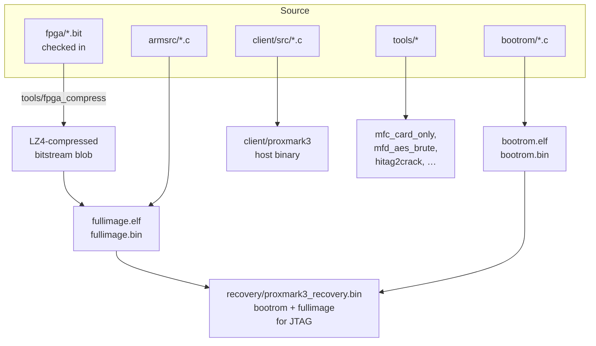
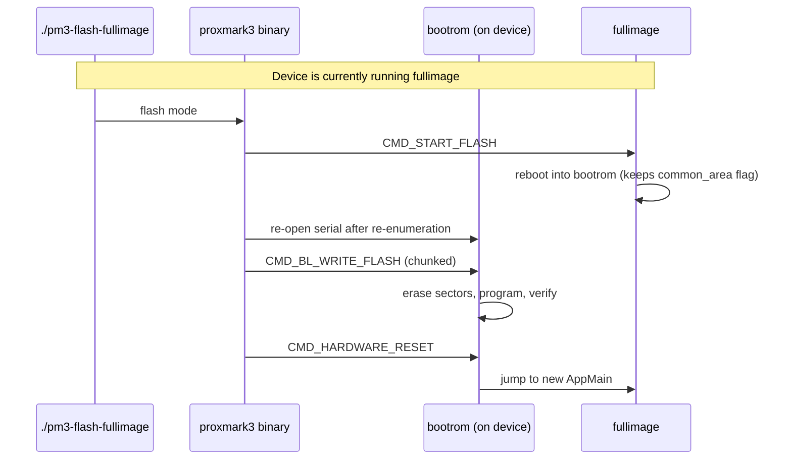

# 08 — Build System

How the recursive Makefile is organised and what artifacts come out.

> This is an **architectural** view of the build, not a step-by-step install guide. For "how do I actually compile this on Ubuntu/macOS/Windows", see `../doc/md/Installation_Instructions/` and `../doc/md/Use_of_Proxmark/0_Compilation-Instructions.md`.

## What gets built



Three independent toolchains are involved:

| Target            | Compiler                                  | Linker                                |
|-------------------|-------------------------------------------|---------------------------------------|
| Host client + tools | system `gcc` / `clang`                   | system `ld`                           |
| Bootrom + fullimage | `arm-none-eabi-gcc` (cross)              | `arm-none-eabi-ld` with `ldscript.common` + per-image ldscript |
| FPGA bitstreams   | Xilinx ISE (proprietary, **not invoked by default**) | (already-built `.bit` files shipped) |

## Top-level Makefile

`Makefile` at the repo root is a thin wrapper that recurses into each component:

```
make           ──┬──▶ make -C bootrom
                 ├──▶ make -C armsrc
                 ├──▶ make -C recovery
                 ├──▶ make -C client
                 ├──▶ make -C tools/mfc/card_only            (mfc_card_only)
                 ├──▶ make -C tools/mfc/card_reader          (mfc_card_reader)
                 ├──▶ make -C tools/mfd_aes_brute
                 ├──▶ make -C tools/mfulc_des_brute
                 ├──▶ make -C tools/fpga_compress
                 └──▶ make -C tools/cryptorf

make client      → just the host client
make armsrc      → just fullimage
make bootrom     → just bootrom
make recovery    → combined image for JTAG
make host        → all host-side stuff (client + tools)
make hitag2crack → cracking suite (NOT in default `all`)
make install     → copy everything into $PREFIX (default /usr/local)
make clean       → recursive clean
```

Plus three configuration files at the top:

- `Makefile.defs` — toolchain detection (`CC`, `CROSS_CC`, `MKDIR`, OS detection).
- `Makefile.host` — shared rules for host-side (non-cross) builds.
- `Makefile.platform` — **the file you create yourself** to pin platform/options. Sample at `Makefile.platform.sample`:
  ```make
  PLATFORM=PM3RDV4               # or PM3GENERIC / PM3ICOPYX / PM3ULTIMATE
  PLATFORM_EXTRAS=BTADDON        # optional, for the BT add-on
  STANDALONE=LF_SAMYRUN          # optional, picks the standalone-mode .c file
  ```
  If absent, defaults from `common_arm/Makefile.hal` apply (`PM3RDV4`, no extras, no standalone).

## Platform / HAL system

```
                 You set in Makefile.platform:
                 ┌──────────────────────┐
                 │ PLATFORM=PM3RDV4     │
                 │ PLATFORM_EXTRAS=…    │
                 │ STANDALONE=…         │
                 └──────────┬───────────┘
                            ▼
                 common_arm/Makefile.hal
                            │
                ┌───────────┴────────────┐
                ▼                        ▼
   PLATFORM_DEFS=-DRDV4 …          which FPGA bitstreams
   (preprocessor flags             to embed in fullimage:
   used by armsrc + bootrom)        FPGA_LF, FPGA_HF,
                                    FPGA_HF_15, FPGA_FELICA
                            │
                            ▼
                 armsrc/Standalone/Makefile.hal
                            │
                            ▼
                 picks which Standalone/*.c
                 is compiled into RunMod()
```

The HAL controls:

- Which board (RDV4 / generic / iCopy-X / Ultimate) — different SoC pins, optional peripherals.
- Whether external SPI flash, smartcard SAM, BT add-on UART, FPC USART are compiled in.
- Which FPGA bitstreams are bundled (which one(s) are valid for the selected board).
- Which standalone mode (if any) is compiled in.

## Build outputs and where they end up

```
bootrom/obj/bootrom.elf          → bootrom/obj/bootrom.bin
armsrc/obj/fullimage.elf         → armsrc/obj/fullimage.bin
recovery/proxmark3_recovery.bin  ← bootrom + fullimage combined
client/proxmark3                 ← host binary
tools/.../<various>              ← host helper binaries
```

The `./pm3` script at the repo root is a thin wrapper that:

1. Auto-detects the serial port (`/dev/ttyACM*` etc.).
2. Sets PATH/LIBPATH so the freshly-built `client/proxmark3` can find its resources.
3. Forwards args.

`./pm3-flash`, `./pm3-flash-all`, `./pm3-flash-bootrom`, `./pm3-flash-fullimage` are similar wrappers around the client's flash command.

## Flashing path



JTAG recovery (when bootrom is gone): `tools/jtag_openocd/` + the combined `recovery/proxmark3_recovery.bin`.

## What's NOT in the default build

- **FPGA Verilog → bitstream.** Needs Xilinx ISE 14.7. The `.bit` files in `fpga/` are pre-built and tracked in git. See `fpga/tests/` and `fpga/strip_date_time_from_binary.py` for the reproducible-build helper.
- **`hitag2crack`.** Build explicitly: `make hitag2crack`.
- **Coverity / lint.** See `covbuild.sh`, `covconfig.sh`, `covsubmit.sh`.
- **Tests.** `tools/pm3_tests.sh` runs the integration suite (needs hardware or simulator).
- **Docker images.** `docker/` has per-distro images for reproducible builds.

## Documentation flow

```
+--------------------+   make install   +--------------------+
| doc/*.md           |  ───────────▶    | $PREFIX/share/doc/ |
| doc/md/**          |  copied verbatim | proxmark3/         |
+--------------------+                  +--------------------+

+--------------------+
| docs/*.md          |  ← developer architecture docs
|  (this directory)  |    NOT installed; lives in the repo only
+--------------------+
```

`INSTALLDOCS=doc/*.md doc/md` in the root Makefile — the user-facing `doc/` is what gets shipped to `/usr/local/share/doc/proxmark3/`. This `docs/` directory is intentionally repo-only.
