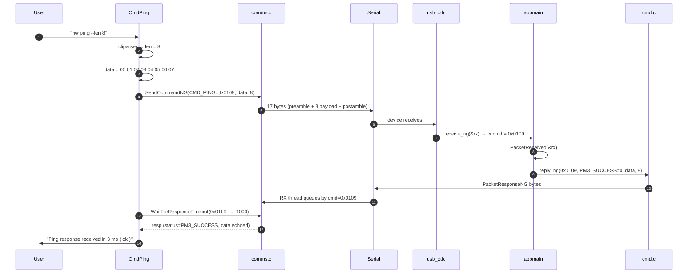
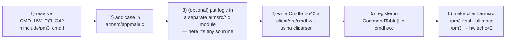

# 09 — Worked Examples

Concrete walk-throughs that bolt down the abstractions in the previous chapters. Every snippet here is either copy-pasted from the actual source tree (with file:line references) or is a deliberately minimal "dummy" version designed to illustrate one concept.

Sections:

- [A. Daily-use CLI sessions](#a-daily-use-cli-sessions)
- [B. End-to-end: `hw ping` — every layer it crosses](#b-end-to-end-hw-ping)
- [C. End-to-end: `hf 14a reader` — full RFID round-trip](#c-end-to-end-hf-14a-reader)
- [D. Exact bytes on the wire (PacketCommandNG / ResponseNG)](#d-exact-bytes-on-the-wire)
- [E. FPGA: what bits actually flip when you select HF reader mode](#e-fpga-what-bits-actually-flip)
- [F. Dummy command: adding `hw echo42` end-to-end](#f-dummy-command-hw-echo42-end-to-end)
- [G. Dummy standalone mode: `hf_helloblink`](#g-dummy-standalone-mode-hf_helloblink)
- [H. Reading a card from a Lua script](#h-reading-a-card-from-a-lua-script)
- [I. Build / flash / run cheat sheet](#i-build--flash--run-cheat-sheet)

---

## A. Daily-use CLI sessions

What people actually type. All commands are entered at the `[usb] pm3 -->` prompt after launching `./pm3`.

### A.1 Is it alive?

```text
$ ./pm3
[=] Session log /home/me/.proxmark3/logs/log_20260512.txt
[=] Loading preferences from /home/me/.proxmark3/preferences.json
[+] Connected to /dev/ttyACM0

[usb] pm3 --> hw ping
[=] Ping sent with payload len... 32
[+] Ping response received in 4 ms and content ( ok )

[usb] pm3 --> hw version
 [ Proxmark3 RFID instrument ]
   [ CLIENT ]
  client.................. Iceman/master/v4.19237 ...
   [ ARM ]
  bootrom................. Iceman/master/v4.19237 ...
  os...................... Iceman/master/v4.19237 ...
   [ FPGA ]
  LF image build for 2s30vq100 on 2025-04-12 ...
  HF image build for 2s30vq100 on 2025-04-12 ...
  HF FeliCa image build for 2s30vq100 ...
  HF 15 image build for 2s30vq100 ...

[usb] pm3 --> hw status
 [ Proxmark3 RFID instrument ]
  Unique ID (uC): 0x... 
  USB-connected
  HF FPGA image loaded
  ...
```

### A.2 Reading a contactless tag

```text
[usb] pm3 --> hf 14a info
 -- ISO/IEC 14443-A Information ---------------------
  UID:  04 a1 b2 c3 d4 e5 80
  ATQA: 00 44
   SAK: 00 [2]
  TYPE: NXP MIFARE Ultralight EV1 64bytes
 ...
```

### A.3 Cloning an HID Prox card (LF)

```text
[usb] pm3 --> lf hid reader -@         # @ = repeat until button press
[+] HID H10301 26-bit; FC: 123  CN: 45678  parity: ok

[usb] pm3 --> lf hid clone -w H10301 --fc 123 --cn 45678
[=] Preparing to clone HID tag
[+] Done!

[usb] pm3 --> lf hid reader
[+] HID H10301 26-bit; FC: 123  CN: 45678  parity: ok
```

### A.4 Sniffing the air

```text
[usb] pm3 --> hf 14a sniff
[#] Starting to sniff. Press button to abort.
... (place real reader + card near antenna) ...
[#] trace len = 4096
[+] Done!

[usb] pm3 --> trace list -t 14a
       Start |        End | Src | Data (! denotes parity error) | CRC | Annotation
-------------+------------+-----+-------------------------------+-----+-----------
           0 |       1056 | Rdr | 52                            |     | WUPA
        2244 |       4324 | Tag | 04  00                        |     | ATQA
        6144 |      11968 | Rdr | 93  20                        |     | ANTICOLL
        ...
```

### A.5 Scripting

```text
[usb] pm3 --> script list                         # list bundled Lua + Python
[usb] pm3 --> script run hf_mfu_dumptoemulator    # Lua
[usb] pm3 --> script run -s hf_mfu_dump.py        # Python
```

---

## B. End-to-end: `hw ping`

The simplest possible command that still touches every layer. From real source:

### B.1 Host side — `client/src/cmdhw.c:1542`

```c
static int CmdPing(const char *Cmd) {
    CLIParserContext *ctx;
    CLIParserInit(&ctx, "hw ping",
                  "Test if the Proxmark3 is responsive",
                  "hw ping\n"
                  "hw ping --len 32");
    void *argtable[] = {
        arg_param_begin,
        arg_u64_0("l", "len", "<dec>", "length of payload to send"),
        arg_param_end
    };
    CLIExecWithReturn(ctx, Cmd, argtable, true);
    uint32_t len = arg_get_u32_def(ctx, 1, 32);   // default 32 bytes
    CLIParserFree(ctx);

    uint8_t data[PM3_CMD_DATA_SIZE] = {0};
    for (uint16_t i = 0; i < len; i++)
        data[i] = i & 0xFF;                       // payload 0x00 0x01 ... 0x1F

    clearCommandBuffer();
    uint64_t tms = msclock();
    SendCommandNG(CMD_PING, data, len);           // ── (1)

    PacketResponseNG resp;
    if (WaitForResponseTimeout(CMD_PING, &resp, 1000)) {  // ── (4)
        tms = msclock() - tms;
        bool error = (memcmp(data, resp.data.asBytes, len) != 0);
        PrintAndLogEx(error ? ERR : SUCCESS,
                      "Ping response received in %" PRIu64 " ms ( %s )",
                      tms, error ? "fail" : "ok");
    } else {
        PrintAndLogEx(WARNING, "Ping response timeout");
    }
    return PM3_SUCCESS;
}
```

### B.2 Firmware side — `armsrc/appmain.c`

```c
case CMD_PING: {
    // packet->data.asBytes  is the bytes you sent
    // packet->length         is how many
    // Echo them straight back as the response payload.
    reply_ng(CMD_PING, PM3_SUCCESS, packet->data.asBytes, packet->length);
    break;
}
```

That is the **entire** firmware handler for ping. It is the minimal template every command follows.

### B.3 What the user sees

```text
[usb] pm3 --> hw ping --len 8
[=] Ping sent with payload len... 8
[+] Ping response received in 3 ms and content ( ok )
```

Sequence:



---

## C. End-to-end: `hf 14a reader`

The standard "read me a contactless tag" command. Shows all three tiers in motion (host → firmware → FPGA → RF).

### C.1 Host side — `client/src/cmdhf14a.c:621`

```c
SendCommandMIX(CMD_HF_ISO14443A_READER,
               ISO14A_CONNECT | ISO14A_CLEARTRACE,   // arg0 = flags
               0,                                    // arg1
               0,                                    // arg2
               NULL, 0);
```

`ISO14A_CONNECT | ISO14A_CLEARTRACE` = `(1<<0) | (1<<17)` = `0x00020001`. That's the entire request — no payload, just three 64-bit args (MIX framing).

### C.2 Firmware dispatcher — `armsrc/appmain.c:1869`

```c
case CMD_HF_ISO14443A_READER: {
    ReaderIso14443a(packet);
    break;
}
```

### C.3 Firmware handler — `armsrc/iso14443a.c:3740`

```c
void ReaderIso14443a(PacketCommandNG *c) {
    iso14a_command_t param = c->oldarg[0];   // 0x00020001 — flags
    // ...

    if ((param & ISO14A_CLEARTRACE) == ISO14A_CLEARTRACE)
        clear_trace();
    set_tracing(true);

    if ((param & ISO14A_CONNECT) == ISO14A_CONNECT) {
        iso14443a_setup(FPGA_HF_ISO14443A_READER_LISTEN);   // ── FPGA goes live

        iso14a_card_select_t *card = (iso14a_card_select_t *)buf;
        arg0 = iso14443a_select_cardEx(NULL, card, &crypto1_uid,
                                       /*anticol*/ true, /*cascade*/ 0,
                                       /*no_rats*/ false, /*polling*/ NULL,
                                       /*magic*/ false);
        // ... reply_mix back to host with the populated card struct ...
    }
}
```

### C.4 The `iso14a_card_select_t` that comes back — `include/mifare.h:52`

```c
typedef struct {
    uint8_t uid[10];
    uint8_t uidlen;
    uint8_t atqa[2];
    uint8_t sak;
    uint8_t ats_len;
    uint8_t ats[256];
} PACKED iso14a_card_select_t;
```

A typical reply payload for a MIFARE Classic 1K card:

```
uid     04 a1 b2 c3 d4 e5 80 00 00 00
uidlen  07
atqa    00 44
sak     08
ats_len 00
ats     (empty)
```

### C.5 What the FPGA is doing during that one second

```
ARM  ─FpgaDownloadAndGo(FPGA_BITSTREAM_HF)─▶  loads fpga_pm3_hf.bit (if not already)

ARM  ─FpgaWriteConfWord(0x0080 | 0x...)─────▶  major=HF_ISO14443A, minor=READER_LISTEN
                                              FPGA starts powering the 13.56 MHz coil,
                                              demodulating tag response onto SSC

ARM  ─tx ── modulate(req-A 0x26) ──────────▶  via ssp_dout → FPGA → coil
                                              tag answers with ATQA 00 44 via load mod
ARM  ◀── rx (demodulated bits) ─── SSC DMA ─  FPGA → ARM

ARM  ─tx ── anticollision frames ──────────▶
ARM  ◀── UID cascade levels ───────────────
ARM  ─tx ── SELECT ───────────────────────▶
ARM  ◀── SAK ─────────────────────────────
```

The ARM never directly toggles the antenna. The FPGA carrier generator, modulator and demodulator handle every bit on the air.

---

## D. Exact bytes on the wire

Take `hw ping --len 4` with payload `00 01 02 03`. The host actually transmits these 16 bytes over USB-CDC:

```
offset  bytes              meaning
 0..3   50 4d 33 61        magic "PM3a" (COMMANDNG_PREAMBLE_MAGIC = 0x61334d50, little-endian)
 4..5   04 80              length=4, ng=1   (low 15 bits = length, top bit = ng)
 6..7   09 01              cmd = 0x0109 = CMD_PING
 8..11  00 01 02 03        payload
12..13  XX XX               crc16 over preceding bytes
14..15  61 33               postamble magic "a3" (COMMANDNG_POSTAMBLE_MAGIC = 0x3361)
```

The device replies with:

```
offset  bytes              meaning
 0..3   50 4d 33 62        magic "PM3b" (RESPONSENG_PREAMBLE_MAGIC)
 4..5   04 80              length=4, ng=1
 6      00                 status   = PM3_SUCCESS (0)
 7      00                 reason   = PM3_REASON_UNKNOWN
 8..9   09 01              cmd = 0x0109
10..13  00 01 02 03        echoed payload
14..15  YY YY               crc16
16..17  62 33               postamble "b3"
```

Reference structs in `include/pm3_cmd.h:34-100`:

```c
typedef struct {
    uint32_t magic;           // "PM3a"
    uint16_t length : 15;
    bool     ng     : 1;
    uint16_t cmd;
} PACKED PacketCommandNGPreamble;

typedef struct {
    uint32_t magic;           // "PM3b"
    uint16_t length : 15;
    bool     ng     : 1;
    int8_t   status;
    int8_t   reason;
    uint16_t cmd;
} PACKED PacketResponseNGPreamble;
```

Status codes you'll see in `resp.status` (`include/pm3_cmd.h:987`):

| Value | Macro             | Meaning |
|-------|-------------------|---------|
|   0   | `PM3_SUCCESS`     | OK |
|  -2   | `PM3_EINVARG`     | bad argument |
|  -4   | `PM3_ETIMEOUT`    | operation timed out |
|  -5   | `PM3_EOPABORTED` | user pressed the button / `CMD_BREAK_LOOP` |
|  -8   | `PM3_EIO`         | serial / hardware I/O error |
| -23   | `PM3_ETEAROFF`    | tear-off hook fired |

---

## E. FPGA: what bits actually flip

When the firmware says "go into HF ISO14443-A reader-listen mode":

```c
// armsrc/iso14443a.c:3766
iso14443a_setup(FPGA_HF_ISO14443A_READER_LISTEN);
```

…internally this calls:

```c
FpgaDownloadAndGo(FPGA_BITSTREAM_HF);                                       // (1)
FpgaWriteConfWord(FPGA_MAJOR_MODE_HF_ISO14443A | FPGA_HF_ISO14443A_READER_LISTEN);  // (2)
```

The constants (from `armsrc/fpgaloader.h`):

| Symbol | Value |
|---|---|
| `FPGA_MAJOR_MODE_HF_ISO14443A`      | `(2<<6)` = `0x0080` |
| `FPGA_HF_ISO14443A_READER_LISTEN`   | varies, but a small minor-mode number, e.g. `0x04` |

So the 16-bit value shifted out over SPI to the FPGA is roughly:

```
opcode = FPGA_CMD_SET_CONFREG (=1)
config = 0x0080 | 0x0004 = 0x0084

      bit:  15 14 13 12 | 11 10 09 08 07 06 05 04 03 02 01 00
            ─ opcode ─    ┬─ major_mode ─┬   ┬─ minor flags ─┬
        0  0  0  1     0  0  0   1  0    0   0  0  1  0  0
            ^                    ^                 ^
            SET_CONFREG          HF_ISO14443A      READER_LISTEN minor
```

(Layout per `fpga/define.v` line 31-44.)

Inside the FPGA, `fpga_pm3_top.v` clocks those 16 bits into `shift_reg`, decodes `major_mode = conf_word[8:6] = 0b010`, and the `mux8` fabric routes the `hi_iso14443a` sub-module's outputs to the ARM SSC and coil drivers. From this moment, the FPGA is actively driving 13.56 MHz on `pwr_hi`, listening on `adc_d[7:0]`, and shipping demodulated bytes to the ARM via `ssp_din`.

To shut it down:

```c
FpgaWriteConfWord(FPGA_MAJOR_MODE_OFF);   // (7<<6) = 0x01C0
```

---

## F. Dummy command: `hw echo42` end-to-end

The smallest possible new command that crosses every boundary. **Not real code in the tree** — illustrative only.

### F.1 Reserve a command ID — `include/pm3_cmd.h`

```c
// Pick an unused 16-bit ID; existing hw cmds cluster around 0x0100-0x011F.
#define CMD_HW_ECHO42   0x011A
```

### F.2 Firmware handler — `armsrc/appmain.c` (inside the giant `switch`)

```c
case CMD_HW_ECHO42: {
    // Trivial: increment each input byte by 42 and reply.
    uint8_t out[PM3_CMD_DATA_SIZE];
    for (uint16_t i = 0; i < packet->length; i++)
        out[i] = packet->data.asBytes[i] + 42;
    reply_ng(CMD_HW_ECHO42, PM3_SUCCESS, out, packet->length);
    break;
}
```

### F.3 Host handler — `client/src/cmdhw.c`

```c
static int CmdEcho42(const char *Cmd) {
    CLIParserContext *ctx;
    CLIParserInit(&ctx, "hw echo42",
                  "Toy: send bytes, device returns each byte + 42",
                  "hw echo42 --data 010203\n"
                  "hw echo42 -d cafebabe");
    void *argtable[] = {
        arg_param_begin,
        arg_str1("d", "data", "<hex>", "bytes to echo"),
        arg_param_end
    };
    CLIExecWithReturn(ctx, Cmd, argtable, false);

    uint8_t data[PM3_CMD_DATA_SIZE];
    int dlen = 0;
    CLIGetHexWithReturn(ctx, 1, data, &dlen);
    CLIParserFree(ctx);

    clearCommandBuffer();
    SendCommandNG(CMD_HW_ECHO42, data, dlen);

    PacketResponseNG resp;
    if (WaitForResponseTimeout(CMD_HW_ECHO42, &resp, 1500) == false) {
        PrintAndLogEx(WARNING, "timeout");
        return PM3_ETIMEOUT;
    }
    if (resp.status != PM3_SUCCESS) {
        PrintAndLogEx(ERR, "device returned status %d", resp.status);
        return resp.status;
    }
    PrintAndLogEx(SUCCESS, "echo+42: %s", sprint_hex(resp.data.asBytes, resp.length));
    return PM3_SUCCESS;
}
```

### F.4 Register the command — `client/src/cmdhw.c` `CommandTable[]`

```c
{"echo42", CmdEcho42, IfPm3Present, "Dummy: echo back input bytes plus 42"},
```

(Pasted next to the existing `{"ping", CmdPing, ...}` line.)

### F.5 Rebuild and try it

```text
$ make client armsrc
$ ./pm3-flash-fullimage
$ ./pm3
[usb] pm3 --> hw echo42 -d 010203
[+] echo+42: 2B 2C 2D
```

The trail you walked:



---

## G. Dummy standalone mode: `hf_helloblink`

A minimal standalone mode that blinks an LED forever — to show the contract. **Not real code in the tree.**

### G.1 The mode source — `armsrc/Standalone/hf_helloblink.c`

```c
#include "standalone.h"
#include "proxmark3_arm.h"
#include "appmain.h"
#include "ticks.h"
#include "dbprint.h"

void ModInfo(void) {
    DbpString("  HF Hello-Blink — toy standalone that blinks LED A");
}

void RunMod(void) {
    StandAloneMode();          // tell appmain we own the device now
    Dbprintf("hf_helloblink running");

    while (BUTTON_HELD(1000) != BUTTON_HOLD) {  // exit on long press
        LED_A_ON();   SpinDelay(250);
        LED_A_OFF();  SpinDelay(250);
    }
    Dbprintf("hf_helloblink exiting");
}
```

### G.2 Register in `armsrc/Standalone/Makefile.hal`

```make
STANDALONE_MODES += HF_HELLOBLINK
STANDALONE_MODES_REQ_BT     +=     # not BT-required
STANDALONE_MODES_REQ_SMARTCARD +=  # not SAM-required
STANDALONE_MODES_REQ_FLASH +=      # not flash-required
```

### G.3 Add sources in `armsrc/Standalone/Makefile.inc`

```make
ifeq ($(STANDALONE),HF_HELLOBLINK)
    STANDALONE_MODE_FILE = hf_helloblink.c
endif
```

### G.4 Build and try it

```text
$ make armsrc STANDALONE=HF_HELLOBLINK
$ ./pm3-flash-fullimage

# Now disconnect USB and press-hold the button at power-on.
# LED A blinks at 2 Hz until you long-press the button again.
```

See `armsrc/Standalone/readme.md` for the real, complete contract (naming rules, max image size, conflict matrix with other modes).

---

## H. Reading a card from a Lua script

`client/luascripts/` has scripts you can `script run`. A toy one:

```lua
-- save as client/luascripts/hello14a.lua
local cmds = require('commands')
local getopt = require('getopt')

local function main()
    -- Send CMD_HF_ISO14443A_READER with ISO14A_CONNECT | ISO14A_CLEARTRACE
    local c = Command:newMIX{
        cmd     = cmds.CMD_HF_ISO14443A_READER,
        arg1    = 0x00020001,   -- (1<<17)|(1<<0) = CLEARTRACE | CONNECT
    }
    local result, err = c:sendMIX()
    if err then return oops(err) end

    local count, cmd, arg0, arg1, arg2, data = bin.unpack('LLLLH512', result)
    if arg0 == 0 then return oops('no card') end

    -- data starts with iso14a_card_select_t — first byte block is the UID
    print(('UID: %s'):format(data:sub(1, 14)))   -- 7 bytes hex = 14 chars
end

main()
```

Then:

```text
[usb] pm3 --> script run hello14a
UID: 04A1B2C3D4E580
```

The point: Lua scripts use the **same `CMD_HF_ISO14443A_READER`** with the **same flag bits** as the C client — the protocol is the API.

---

## I. Build / flash / run cheat sheet

Pinning a platform and standalone mode the easy way — create `Makefile.platform` at the repo root:

```make
# Makefile.platform — copied from Makefile.platform.sample
PLATFORM=PM3RDV4
PLATFORM_EXTRAS=BTADDON        # delete if no BT add-on
STANDALONE=HF_ICECLASS         # or LF_SAMYRUN, or HF_HELLOBLINK from §G, or blank
```

Then:

```text
# everything
$ make -j

# pieces
$ make client          # just the host program
$ make armsrc          # just fullimage.elf/.bin
$ make bootrom         # just bootrom.elf/.bin
$ make recovery        # combined image for JTAG

# flash
$ ./pm3-flash-all              # bootrom + fullimage
$ ./pm3-flash-fullimage        # most common (bootrom rarely changes)
$ ./pm3-flash-bootrom          # rare; needs an existing bootrom to do it over USB

# run
$ ./pm3                        # auto-detect port
$ ./pm3 /dev/ttyACM0           # specify port
$ ./pm3 -p tcp:1.2.3.4:18888   # over TCP
$ ./pm3 -c "hw ping; hw status; quit"   # one-shot, exit when done
$ ./pm3 -l mylog.txt           # custom log file
$ ./pm3 -s commands.cmd        # run a script of REPL commands

# rebuild a single armsrc file fast (after editing one .c)
$ make -C armsrc

# wipe build artifacts
$ make clean
```

Common gotchas:

- **No `Makefile.platform`?** Build defaults to `PM3RDV4`, no BT, no standalone. Fine if you have an RDV4.
- **Wrong platform flashed?** The firmware will boot, but FPGA bitstreams won't match the FPGA part — you'll see garbled RF or nothing. Re-flash with the right `PLATFORM=`.
- **`./pm3` finds no port?** `ModemManager` on Linux grabs `/dev/ttyACM*` — see `../doc/md/Installation_Instructions/ModemManager-Must-Be-Discarded.md`.
- **Stuck in bootloader?** Press the button briefly while plugging in. To exit: `./pm3 -p /dev/ttyACM0 -c "hw reset"` from bootloader prompt.
