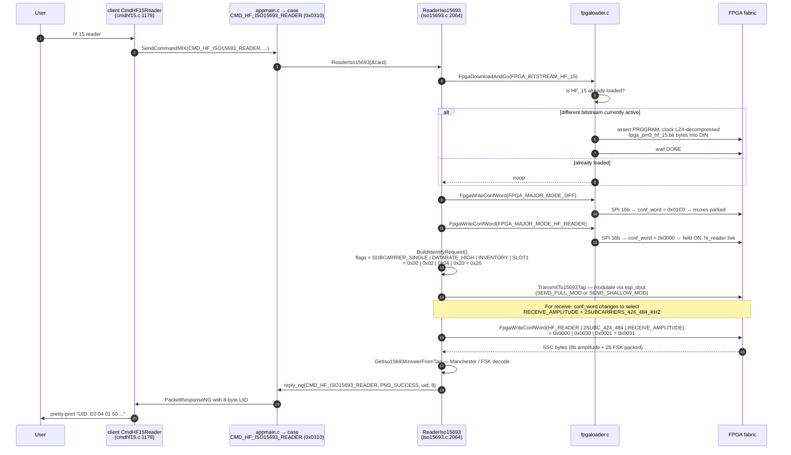

# 10 — Anatomy of a Bitstream: `fpga_pm3_hf_15` (ISO 15693)

A deep, end-to-end tour of **one specific FPGA bitstream** — the ISO15693 variant — to show how a bitstream is composed, what's compiled in vs. left out, what each compile-time `\`define` does, how it differs from its sibling `fpga_pm3_hf`, and how the ARM firmware actually drives it during an `hf 15 reader` session.

Read [`06-fpga.md`](06-fpga.md) first for the general FPGA model; this chapter zooms into one bitstream.

## TL;DR

```
fpga_pm3_hf_15.bit
 └── fpga_pm3_top.v  compiled with -define WITH_HF0 WITH_HF1 WITH_HF3 WITH_HF5
                                     WITH_HF_15 WITH_HF_15_LOWSIGNAL
     ├── hi_reader.v     ← HF reader + 2-subcarrier FSK demod (the 15693 thing)
     ├── hi_simulate.v   ← HF tag simulator (used for `hf 15 sim`)
     ├── hi_sniffer.v    ← passive sniff (`hf 15 sniff`)
     ├── hi_get_trace.v  ← internal FPGA-side trace readout
     ├── (NO hi_iso14443a.v  — WITH_HF2 not set → ISO14A omitted)
     └── (NO hi_flite.v      — WITH_HF4 not set → FeliCa omitted)
```

This bitstream is the one the firmware loads with `FpgaDownloadAndGo(FPGA_BITSTREAM_HF_15)`. It exists as a separate `.bit` because ISO15693's response uses a **two-subcarrier FSK** modulation (`424/484 kHz`) that needs different demodulator logic than plain ISO14443. To save FPGA fabric (the Spartan-II XC2S30 is tiny — 30k gates) you can't fit *every* HF protocol in one bitstream, so the build splits HF into three flavours: `hf`, `hf_15`, `felica`.

## Where it comes from — `fpga/Makefile`

```make
# fpga/Makefile  (excerpt)

# Types of selective module compilation:
# WITH_HF0   enable HF reader (see also WITH_HF_15 below)
# WITH_HF_15 select "iso15 2sc mode" extensions instead of original
# WITH_HF1   enable HF simulated tag
# WITH_HF2   enable HF ISO14443-A
# WITH_HF3   enable sniff
# WITH_HF4   enable HF ISO18092 FeliCa
# WITH_HF5   enable HF get trace

# RDV40/Generic - Enable all HF modules except Felica
TARGET2_OPTIONS = -define \{WITH_HF0 WITH_HF1 WITH_HF2 WITH_HF3 WITH_HF5\}
# RDV40/Generic - Enable all HF modules except Felica and ISO14443,
#                 select HF_15 instead of HF
TARGET3_OPTIONS = -define \{WITH_HF0 WITH_HF1 WITH_HF3 WITH_HF5 \
                            WITH_HF_15 WITH_HF_15_LOWSIGNAL\}

TARGET2_NAME = fpga_pm3_hf       # ← regular HF bitstream
TARGET3_NAME = fpga_pm3_hf_15    # ← THIS chapter
TARGET2_FPGA = xc2s30-5-vq100
TARGET3_FPGA = xc2s30-5-vq100
```

Both targets compile the **same** `fpga_pm3_top.v`. The only differences are the `\`define` set passed to the synthesizer:

| Define                  | `hf` | `hf_15` | What it does |
|-------------------------|:----:|:-------:|---|
| `WITH_HF0`              |  ✓   |    ✓    | Include `hi_reader.v` (reader / receive paths) |
| `WITH_HF1`              |  ✓   |    ✓    | Include `hi_simulate.v` (tag emulation) |
| `WITH_HF2`              |  ✓   |         | Include `hi_iso14443a.v`  — **omitted** from hf_15 |
| `WITH_HF3`              |  ✓   |    ✓    | Include `hi_sniffer.v` |
| `WITH_HF4`              |      |         | FeliCa — never on for either; lives in its own bitstream |
| `WITH_HF5`              |  ✓   |    ✓    | Include `hi_get_trace.v` |
| `WITH_HF_15`            |      |    ✓    | **Switch `hi_reader.v` into 2-subcarrier-FSK mode** |
| `WITH_HF_15_LOWSIGNAL`  |      |    ✓    | Relax the input-amplitude hysteresis for weak vicinity-card signals |

So `hf_15` = "the same HF reader bitstream, **minus** the ISO14443-A module, **plus** the 15693 demod inside `hi_reader.v`, **plus** a more sensitive front-end". Sub-modules that aren't `\`ifdef`'d in literally vanish from the synthesized fabric, freeing up logic blocks the FSK demodulator needs.

## What ends up in the top module — `fpga/fpga_pm3_top.v`

```verilog
// fpga_pm3_top.v   (HF half, abbreviated)
`ifdef WITH_HF0
hi_reader hr(
    .ck_1356meg            (ck_1356megb),
    .adc_d                 (adc_d),
    .subcarrier_frequency  (conf_word[5:4]),   // ── ARM-supplied
    .minor_mode            (conf_word[3:0]),   // ── ARM-supplied
    .ssp_dout              (ssp_dout),
    .ssp_din               (mux0_ssp_din),     // routed to mux input 0
    .ssp_frame             (mux0_ssp_frame),
    .ssp_clk               (mux0_ssp_clk),
    .adc_clk               (mux0_adc_clk),
    .pwr_lo                (mux0_pwr_lo),
    .pwr_hi                (mux0_pwr_hi),
    .pwr_oe1               (mux0_pwr_oe1),
    .pwr_oe2               (mux0_pwr_oe2),
    .pwr_oe3               (mux0_pwr_oe3),
    .pwr_oe4               (mux0_pwr_oe4),
    .debug                 (mux0_debug)
);
`endif

`ifdef WITH_HF1  hi_simulate    hs(...);  `endif  // mux input 1
// WITH_HF2 (hi_iso14443a) — NOT compiled in hf_15 → mux input 2 left floating
`ifdef WITH_HF3  hi_sniffer     he(...);  `endif  // mux input 3
// WITH_HF4 (hi_flite / FeliCa) — NOT compiled
`ifdef WITH_HF5  hi_get_trace   gt(...);  `endif  // mux input 5

mux8 mux_ssp_din   (.sel(conf_word[8:6]), .y(ssp_din),   .x0(mux0_ssp_din), …);
mux8 mux_pwr_hi    (.sel(conf_word[8:6]), .y(pwr_hi),    .x0(mux0_pwr_hi), …);
// …one mux8 per output pin…
```

What this means at runtime: the same FPGA fabric contains *all* the included sub-modules in parallel, all running, all looking at the ADC; the **mux8** fabric (selected by `conf_word[8:6]` = `major_mode`) just decides whose outputs are wired to the device pins. So in `hf_15`:

```
major_mode (conf_word[8:6])    →   active sub-module          ARM-side enum
  0  (FPGA_MAJOR_MODE_HF_READER)    hi_reader                  used for `hf 15 reader/sniff/etc.`
  1  (FPGA_MAJOR_MODE_HF_SIMULATOR) hi_simulate                used for `hf 15 sim`
  2  (FPGA_MAJOR_MODE_HF_ISO14443A) ⚠ floats — module omitted  do not select
  3  (FPGA_MAJOR_MODE_HF_SNIFF)     hi_sniffer
  4  (FPGA_MAJOR_MODE_HF_ISO18092)  ⚠ floats — module omitted
  5  (FPGA_MAJOR_MODE_HF_GET_TRACE) hi_get_trace
  7  (FPGA_MAJOR_MODE_OFF)          all outputs idle
```

Selecting `HF_ISO14443A` on the `hf_15` bitstream gets you garbage outputs (the mux line is undriven). That's why the ARM firmware re-loads the right bitstream for the right tag family — see `armsrc/iso15693.c:1603`:

```c
void Iso15693InitReader(void) {
    LEDsoff();
    FpgaDownloadAndGo(FPGA_BITSTREAM_HF_15);     // (1) switch fabric if needed
    FpgaWriteConfWord(FPGA_MAJOR_MODE_OFF);      // (2) park outputs
    SpinDelay(10);
    FpgaWriteConfWord(FPGA_MAJOR_MODE_HF_READER);// (3) field ON, reader path live
    LED_D_ON();
    FpgaSetupSsc(FPGA_MAJOR_MODE_HF_READER);     // (4) ARM SSC matches FPGA mode
    SetAdcMuxFor(GPIO_MUXSEL_HIPKD);
    set_tracing(true);
    SpinDelay(250);                              //     let tags energize
    StartCountSspClk();
}
```

## Inside `hi_reader.v` — the meat

This module is the same one as in the plain `hf` bitstream, but with extra blocks gated by `\`ifdef WITH_HF_15`. There are four concerns: hysteresis on the reader's own AM signal, sub-carrier reference generation, correlator output formatting, and the **2-subcarrier FSK matched filter** that is unique to 15693.

### 1. Front-end hysteresis — relaxed in `hf_15`

```verilog
// hi_reader.v:46
always @(negedge adc_clk) begin
`ifdef WITH_HF_15_LOWSIGNAL
    if (& adc_d[7:4]) after_hysteresis <= 1'b1;     // any 4 high bits → high
    else if (~(| adc_d[7:6])) after_hysteresis <= 1'b0;
`else
    if (& adc_d[7:0]) after_hysteresis <= 1'b1;     // strict: full 0xFF
    else if (~(| adc_d[7:0])) after_hysteresis <= 1'b0;
`endif
    ...
end
```

`WITH_HF_15_LOWSIGNAL` makes the hysteresis trigger on the top nibble instead of the full byte, so weak vicinity-card responses still get edge-detected. This is the kind of tradeoff that explains why a separate bitstream exists at all.

### 2. Sub-carrier reference — selected by `conf_word[5:4]`

```verilog
// hi_reader.v:228
always @(*) begin
    if (subcarrier_frequency == `FPGA_HF_READER_SUBCARRIER_848_KHZ) begin
        subcarrier_I = ~corr_i_cnt[3];
        subcarrier_Q = ~(corr_i_cnt[3] ^ corr_i_cnt[2]);
    end else if (subcarrier_frequency == `FPGA_HF_READER_SUBCARRIER_212_KHZ) begin
        subcarrier_I = ~corr_i_cnt[5];
        subcarrier_Q = ~(corr_i_cnt[5] ^ corr_i_cnt[4]);
    end else begin // 424 kHz (default)
        subcarrier_I = ~corr_i_cnt[4];
        subcarrier_Q = ~(corr_i_cnt[4] ^ corr_i_cnt[3]);
    end
end
```

`corr_i_cnt` is a 6-bit counter clocked at the 13.56 MHz `adc_clk`. The reference squarewaves are produced by tapping different bits of that counter — that's literally division by 16 / 8 / 32 of the carrier.

| `subcarrier_frequency` (`conf_word[5:4]`) | Macro                                       | Use                |
|:---:|---|---|
| `00` | `FPGA_HF_READER_SUBCARRIER_848_KHZ`         | ISO14443-A / B high subcarrier |
| `01` | `FPGA_HF_READER_SUBCARRIER_424_KHZ`         | ISO15693 single-subcarrier ASK |
| `10` | `FPGA_HF_READER_SUBCARRIER_212_KHZ`         | rarely used |
| `11` | `FPGA_HF_READER_2SUBCARRIERS_424_484_KHZ`   | **ISO15693 two-subcarrier FSK** |

ISO15693 vicinity cards may respond in either "1-out-of-256" or "1-out-of-4" coding, and at either 1 or 2 subcarriers — that's the entire reason this bitstream exists.

### 3. The 2-subcarrier FSK demodulator (the `hf_15` exclusive)

```verilog
// hi_reader.v:80
`ifdef WITH_HF_15
reg [1:0] fskout = 2'd0;          // 2-bit FSK estimate: 00 idle, 01 / 10 two tones, 11 transition
reg [127:0] avg128 = 128'd0;      // 16-sample averages, used as a delay line
reg [11:0] match16, match28, match32;

always @(negedge adc_clk) begin
    // Build a sliding-window correlator at three candidate periods:
    //   16-sample (848 kHz),
    //   28-sample (424 kHz, the lower of the two FSK tones),
    //   32-sample (484 kHz nominal — the upper FSK tone)
    // diff16 / diff28 / diff32 = |avg - avg128[ … ]|
    // match*  = running sum of those diffs over 32 samples

    if (corr_i_cnt[4:1] == 4'b1111) begin // every 32 clocks
        // pick the period with the smallest mismatch — that's the tone present now
        if (match16 < 12'd64 && last0)
            fskout = 2'b00;                            // nothing yet
        else if ((match16 | match28 | match32) == 0)
            fskout = 2'b00;                            // ended
        else if (((match16 <= match28+16) && (match16 <= match32+16)) ||
                 (match28 <= 16 && match32 <= 16))
            fskout = 2'b11;                            // 848 kHz dominates — invalid for 15693
        else begin
            if (match28 < match32) fskout = 2'b01;     // 424 kHz tone
            else                   fskout = 2'b10;     // 484 kHz tone
        end
    end
end
`endif
```

That's the 15693 secret sauce: three short correlators in parallel, deciding every 32 samples which of `{none, 424 kHz, 484 kHz, 848 kHz}` is present, emitted as 2 bits the ARM can read on each correlator-output cycle. The ARM-side `hi_reader` ↔ ARM byte stream becomes denser in `hf_15`:

```verilog
// hi_reader.v:291  — RECEIVE_AMPLITUDE path
else if (minor_mode == `FPGA_HF_READER_MODE_RECEIVE_AMPLITUDE) begin
`ifdef WITH_HF_15
    if (subcarrier_frequency == `FPGA_HF_READER_2SUBCARRIERS_424_484_KHZ) begin
        // 2-subcarrier FSK: pack the 2-bit FSK decision into the I byte
        corr_i_out <= {fskout, corr_amplitude[13:8]};
        corr_q_out <= corr_amplitude[7:0];
    end else
`endif
    begin
        // plain amplitude only
        corr_i_out <= {2'b00, corr_amplitude[13:8]};
        corr_q_out <= corr_amplitude[7:0];
    end
end
```

In the regular `fpga_pm3_hf` bitstream, those top 2 bits of `corr_i_out` are always zero. In `hf_15` with 2-subcarrier mode selected, they encode the FSK decision. ARM-side `armsrc/iso15693.c` reads that and decodes bits.

## ARM ↔ FPGA call sequence during `hf 15 reader`

Putting it all together:



### Exact config-word values you'd see on the SPI lines

For an `hf 15 reader` inventory request:

| Step | ARM code                                                                 | Bits sent to FPGA |
|------|--------------------------------------------------------------------------|-------------------|
| Park | `FpgaWriteConfWord(FPGA_MAJOR_MODE_OFF)`                                 | opcode `0001` ‖ `0` ‖ `111` ‖ `0_0000_0000` = `0x11C0` |
| Field on | `FpgaWriteConfWord(FPGA_MAJOR_MODE_HF_READER)`                       | `0001` ‖ `0_000_0000_0000` = `0x1000` (major=0=HF_READER, no flags) |
| TX 1-out-of-4 | `FpgaWriteConfWord(HF_READER \| SEND_FULL_MOD)` (iso15693.c:298+) | `0001` ‖ `0_000_0000_0011` = `0x1003` (minor=3) |
| RX FSK | `FpgaWriteConfWord(HF_READER \| 2SUBC_424_484 \| RECEIVE_AMPLITUDE)` | `0001` ‖ `0_000_0011_0001` = `0x1031` |

Decoded:

```
              [15:12]   [11:9]   [8:6]      [5:4]       [3:0]
opcode (C):   0001 = SET_CONFREG
              ───────                                            ┐
trace bit:               0                                       │
major_mode:                       000  ← HF_READER               │   conf_word
subcarrier:                                 11 ← 2SUBC_424_484   │
minor_mode:                                              0001    │   loaded into
                                                ← RECEIVE_AMPLITUDE   16-bit shift_reg
                                                                 ┘   in fpga_pm3_top.v
```

(Top 4 bits are the opcode `FPGA_CMD_SET_CONFREG`; the rest is the actual `conf_word` that the Verilog sees.)

## Differences in the bitstream summary

```
                       fpga_pm3_hf.bit                fpga_pm3_hf_15.bit
                       ───────────────                ─────────────────
included sub-modules:  hi_reader                      hi_reader (with HF_15 demod)
                       hi_simulate                    hi_simulate
                       hi_iso14443a   ←  YES          ──── omitted ─
                       hi_sniffer                     hi_sniffer
                       hi_get_trace                   hi_get_trace
                       (no hi_flite)                  (no hi_flite)

reader front-end:      strict hysteresis (full byte)  relaxed hysteresis
                                                       (top nibble only)

2-subcarrier FSK:      compiled out                   compiled in
                                                      (~3 correlators + decision)

target FPGA:           xc2s30-5-vq100                 xc2s30-5-vq100
file size on flash:    ~42 KB (LZ4-compressed)        ~42 KB (LZ4-compressed)
                       see FPGA_CONFIG_SIZE in common_fpga/fpga.h
```

## Variants per board

```
boards using this bitstream
───────────────────────────
fpga_pm3_hf_15.bit         RDV4 / RDV3-easy / kkmoon / etc.  (xc2s30)
fpga_pm3_ult_hf_15.bit     Proxmark3 Ultimate                (xc2s50)
fpga_icopyx_hf_15.bit      iCopy-X                           (xc3s100e)
```

All three are built from the same Verilog with the same `WITH_HF_15` define, just targeted at a different Xilinx part. The ARM-side `FPGA_BITSTREAM_HF_15` enum value is the same — the bootloader's `version_info` table picks the right physical bit to flash based on the `FPGA_TYPE` macro in `common_fpga/fpga.h`.

## Rebuilding it yourself

You **don't** rebuild bitstreams during a normal firmware build. The `.bit` files are tracked in git and embedded into `fullimage.bin` via `tools/fpga_compress`. To rebuild Verilog you need Xilinx ISE 14.7 (Linux/Windows; proprietary, EOL but still downloadable from Xilinx archive). Then:

```text
$ cd fpga/
$ make fpga_pm3_hf_15.bit
   ... ISE runs xst / ngdbuild / map / par / bitgen ...
$ ls -la fpga_pm3_hf_15.bit
$ git diff fpga_pm3_hf_15.bit         # tooling stamps a timestamp; see
$ python strip_date_time_from_binary.py fpga_pm3_hf_15.bit   # to make builds reproducible
```

Then rebuild the firmware so the new `.bit` gets embedded:

```text
$ make armsrc       # tools/fpga_compress LZ4s the .bit and links it in
$ ./pm3-flash-fullimage
```

## Quick reference — the four bitstreams compared

| Bitstream                  | Major modes that actually work   | Tag families it serves |
|----------------------------|----------------------------------|-------|
| `fpga_pm3_lf.bit`          | LF_READER, LF_EDGE_DETECT, LF_PASSTHRU, LF_ADC | EM410x, HID Prox, T55xx, Hitag*, EM4x50/70, Indala, AWID, IO, Paradox, … |
| `fpga_pm3_hf.bit`          | HF_READER, HF_SIMULATOR, HF_ISO14443A, HF_SNIFF, HF_GET_TRACE | ISO14443-A (MIFARE, NTAG, DESFire), iCLASS, LEGIC, ISO14443-B (calypso, srix), SEOS |
| **`fpga_pm3_hf_15.bit`**   | HF_READER, HF_SIMULATOR, HF_SNIFF, HF_GET_TRACE — **+ 2-subcarrier FSK demod** | **ISO15693 vicinity cards (ICODE SLI/SLIX, TI Tag-It, Picopass, etc.)** |
| `fpga_pm3_felica.bit`      | HF_READER, HF_SIMULATOR, HF_SNIFF, HF_ISO18092, HF_GET_TRACE | Sony FeliCa / Octopus / SUICA |

A given operation drives `FpgaDownloadAndGo(target)` to ensure the right bitstream is live, then `FpgaWriteConfWord(major | minor)` to pick the sub-module and its mode. **Switching bitstream is ~tens of ms; switching mode-within-bitstream is microseconds.**

## See also

- The general FPGA chapter: [`06-fpga.md`](06-fpga.md).
- Worked example using these constants: [`09-examples.md`](09-examples.md) §E.
- Verilog top: `fpga/fpga_pm3_top.v`.
- The bitstream's central module: `fpga/hi_reader.v` (look for every `\`ifdef WITH_HF_15`).
- ARM-side driver: `armsrc/iso15693.c` (`Iso15693InitReader`, `SendDataTag`, `ReaderIso15693`).
- ARM constants: `armsrc/fpgaloader.h` (`FPGA_MAJOR_MODE_*`, `FPGA_HF_READER_*`).
- FPGA constants (Verilog side): `fpga/define.v`.
- Bitstream metadata table (which version string maps to which target): `common_fpga/fpga.h` + `armsrc/fpga_version_info.c`.
- Protocol-level docs (request flags, command bytes): `common/iso15693tools.h`, `include/protocols.h`, `../doc/` notes for specific tags.
